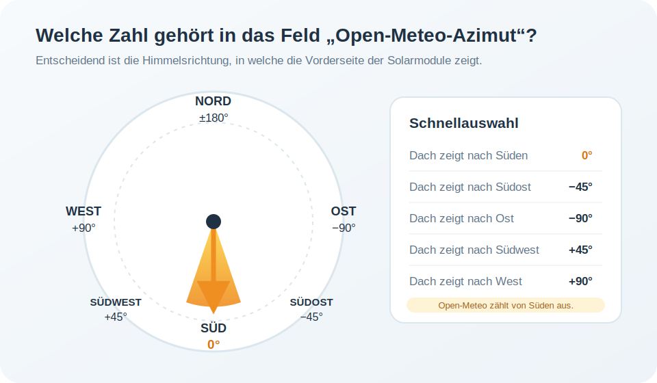

# Solarwetter für Symcon

Eigenständiges Symcon-Modul mit nativer HTML-Kachel zur Berechnung des erwarteten PV-Ertrags aus der Open-Meteo-Solarprognose.

Die 24-Stunden-Grafik zeigt die Stunden ohne den Zusatz „Uhr“ und stellt die Ertragswerte platzsparend gedreht direkt in den Balken dar.

## Voraussetzungen

- Symcon ab Version 7.1
- Internetzugriff auf `api.open-meteo.com`
- keine zusätzlichen Skripte oder Datenvariablen erforderlich

## Konfiguration

- Breitengrad und Längengrad
- Dachneigung
- Open-Meteo-Azimut für die Himmelsrichtung der Modulfläche
- Zeitzone
- Abrufintervall, mindestens 300 Sekunden
- installierte PV-Leistung in kWp
- Performance Ratio
- Wechselrichtergrenze in kW

### Open-Meteo-Azimut richtig einstellen

Der Azimut beschreibt, **in welche Himmelsrichtung die Vorderseite der Solarmodule zeigt**. Open-Meteo verwendet dabei Süden als Ausgangspunkt. Das unterscheidet sich von einem klassischen Kompass, bei dem Norden normalerweise 0° ist.

| Ausrichtung der Module | Eingabewert |
|---|---:|
| Nord | `-180°` oder `180°` |
| Ost | `-90°` |
| Südost | `-45°` |
| Süd | `0°` |
| Südwest | `45°` |
| West | `90°` |

Zwischenwerte sind ebenfalls möglich. Zeigt ein Dach beispielsweise genau zwischen Süden und Westen, wird `45°` eingetragen. Bei einer Ost-West-Anlage bildet eine einzelne Ausrichtung beide Dachseiten nur näherungsweise ab; für getrennte Prognosen können zwei Modulinstanzen mit `-90°` und `90°` verwendet werden.

## Prognosezeiträume

- nächste 24 Stunden
- aktueller Kalendertag von 00:00 bis 24:00 Uhr
- Folgetag von 00:00 bis 24:00 Uhr

## Funktionen

- eigenständiger Open-Meteo-Abruf mit mindestens 72 zukünftigen Prognosestunden
- zentrale Prognosequelle für nachgelagerte Skripte und das Energiemanagement
- bis zu drei HTTP-Versuche pro Aktualisierung
- letzte gültige Prognose bleibt bei kurzen Ausfällen erhalten
- erwarteter PV-Ertrag, Leistungsspitze und Solarqualität
- kompaktes Balkendiagramm aller 24 Stunden des gewählten Zeitraums
- automatische Status- und Ergebnisvariablen
- keine festen Symcon-Objekt-IDs

## Berechnung

`Stundenenergie kWh = min(Wechselrichtergrenze; Globalstrahlung auf PV-Ebene / 1000 × kWp × Performance Ratio)`

Die Open-Meteo-Strahlungsprognose wird mit Dachneigung und Ausrichtung direkt für die PV-Ebene abgerufen.

## Darstellung

Für eine vollständige Darstellung wird eine Kachelgröße von mindestens 3 × 3 Feldern empfohlen.

## Datenschutz und externe Dienste

Das Modul überträgt Standortkoordinaten, Dachneigung, Ausrichtung und Zeitzone an Open-Meteo. Es werden keine Zugangsdaten benötigt.

## Lizenz

MIT
